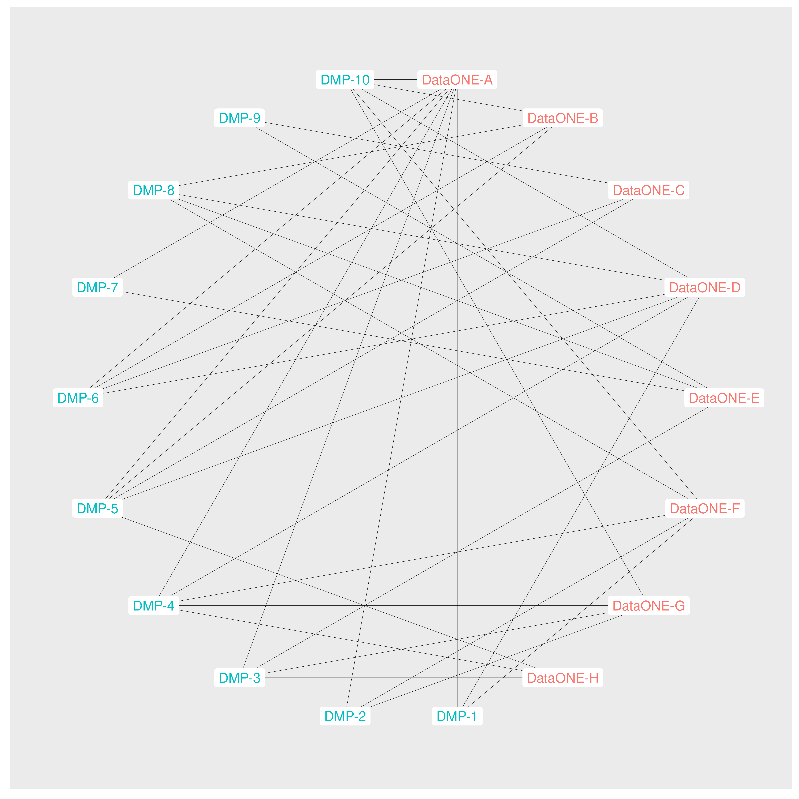
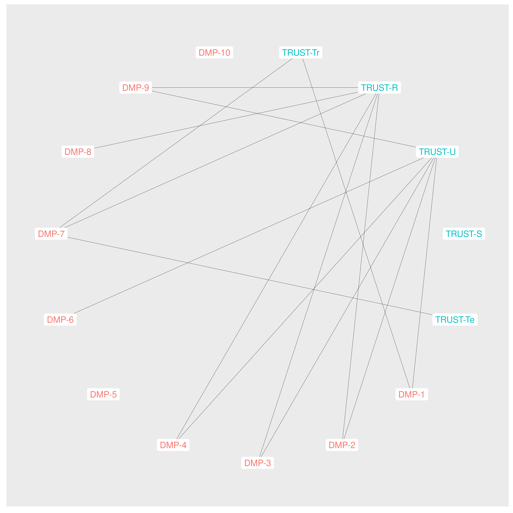

```{r, echo=FALSE, error=TRUE, warning=FALSE, message=FALSE, results="hide"}
# load required libraries
library(googlesheets4)
library(googledrive)
library(tidyverse)
library(igraph)
library(ggraph)
library(knitr)
library(kableExtra)
library(flextable)

opts <- options(knitr.kable.NA = "")
```

```{r, echo=FALSE, error=TRUE, warning=FALSE, message=FALSE, results="hide"}
# Crosswalk between GEO Data Management Principles and selected lifecycles and principles
gsheetURL <- "https://docs.google.com/spreadsheets/d/15Fmw0m2jx-wKNqyzB9AsRbDeokp9NowrZBd7XLHZTEc/edit#gid=1719949641"
gsheetSharingWorksheet <- "Crosswalk-DataSharingPrinciples"
gsheetManagementWorksheet <- "Crosswalk-DataManagementPrinciples"

gs4_deauth() # disable authentication requirements for this public sheet

# get the sheet ids from the google sheet url
ssid <- as_sheets_id(gsheetURL)
unclass(ssid)

# retrieve the base sheet content
lifecycles <- read_sheet(ssid, sheet = "Lifecycles", skip = 1, na = c("-", ""))
dmp_crosswalk <- read_sheet(ssid, sheet = "Crosswalk-DataManagementPrinciples")
dsp_crosswalk <- read_sheet(ssid, sheet = "Crosswalk-DataSharingPrinciples")

# extract nodes 
n_lifecycles <- lifecycles %>% 
  select(matches("-combo$")) %>% 
  gather() %>% 
  filter(!is.na(value)) %>% 
  distinct(value) %>% 
  mutate(label = str_split(value, "-", simplify = FALSE, n = 3)) %>% 
  select(label)

n_dmp <- dmp_crosswalk %>% 
  filter(!is.na(DataManagementPrinciple)) %>% 
  distinct(DataManagementPrinciple) %>% 
  mutate(label = DataManagementPrinciple) %>% 
  select(label)

n_all <- n_lifecycles %>% 
  rowwise() %>% 
  mutate(type = case_when(label[1] == "TRUST" ~ "principle",
                          label[1] == "FAIR" ~ "principle",
                          label[1] == "DataONE" ~ "lifecycle",
                          label[1] == "NIST" ~ "lifecycle",
                          label[1] == "EEA" ~ "lifecycle",
                          label[1] == "DataONE" ~ "lifecycle",
                          label[1] == "NSTC" ~ "lifecycle",
                          label[1] == "DataONE" ~ "lifecycle",
                          label[1] == "EDMF" ~ "lifecycle")) %>% 
  mutate(
    key = paste(label[1], label[2], sep = "-"), 
    source = label[1],
    short_label = key, 
    label = paste(paste(label[1], label[2], sep = "-"), label[3], sep = ": "),
    node_label = label) %>% 
  rbind(mutate(n_dmp,
               key = sapply(strsplit(label, ":"), "[[", 1),
               short_label = key, 
               node_label = label, 
               type = "GEO-Principle",
               source = "GEO")) %>% 
  select(key, short_label, node_label, source, type)
  

e_dmp_lifecycle <- tibble("from" = character(), "to" = character())
dmp_from <- dmp_crosswalk$DataManagementPrinciple
dmp_to <- dmp_crosswalk %>% select(-DataManagementPrinciple, -PrincipleDescription)

for (i in seq_along(dmp_to)) {
  out_to <- dmp_to[[i]]
  out_combined <- bind_cols(dmp_from, out_to)
  e_dmp_lifecycle <- rbind(e_dmp_lifecycle,out_combined)
}

e_dmp_lifecycle <- e_dmp_lifecycle %>% 
  rename(from = 1, to = 2) %>% 
  filter(!is.na(to)) %>% 
  mutate(lifecycle = str_split(to, "-", simplify = TRUE),
         from = sapply(strsplit(from, ":"), "[[", 1),)

n_dmp_lifecycle <- e_dmp_lifecycle %>% 
  select(from, to) %>% 
  gather() %>% 
  select(value) %>% 
  distinct(value)

```

```{r, echo=FALSE, error=TRUE, warning=FALSE, message=FALSE}
# circular plot 1x1 funciton
geo_x_single <- function(title, to_nodes, output_file) {
  edges <- filter(e_dmp_lifecycle, lifecycle[,1] == to_nodes)
  #print(edges)
  vertices <- filter(n_all, (source == to_nodes | source == "GEO"))
  #print(vertices)
  graph <- graph_from_data_frame(
    d = edges,
    vertices = vertices,
    directed = TRUE)
  xy <- layout_(graph,in_circle())
  circular_plot <- ggraph(graph, layout = "linear", circular = TRUE) +
    coord_fixed() +
    geom_edge_link0(width = .1) +
    geom_node_point(aes(color = as.factor(source)), size = 1, show.legend = FALSE) +
    geom_node_label(aes(label = short_label, 
                        color = as.factor(source)), 
                    label.size = 0,
                    show.legend = FALSE) +
    xlim(-1.1, 1.1) +
    ylim(-1.1, 1.1) +
    #ggtitle(title) +
    theme(plot.title = element_text(size = 7, face = "bold"))
  ggsave(paste("images/circular_", output_file, sep = ""), plot = circular_plot, width = 9, height = 9, dpi = 600)
  
   default_plot <- ggraph(graph) +
    geom_edge_link0(width = .1) +
    geom_node_point(aes(color = as.factor(source)), size = 1, show.legend = FALSE) +
    geom_node_label(aes(label = short_label, 
                        color = as.factor(source)), 
                    label.size = 0,
                    show.legend = FALSE) +
    #ggtitle(title) +
    theme(plot.title = element_text(size = 7, face = "bold"))
  ggsave(paste("images/auto_", output_file, sep = ""), plot = default_plot, width =12, height =12, dpi = 600)
  
  #figures <- c(paste("./images/circular_", output_file, sep = ""), paste("./images/auto_", output_file, sep = ""))
  #return(figures)
}
```


| **GEO Working Group**: [Data Working Group (Data-WG)](https://www.earthobservations.org/data_wg.php)
| **Subgroup**: *Data Sharing and Data Management Principles* (Data-WG/DSDMP). In particular, the following subgroup members provided invaluable input into the development of the approach used in the development of this analysis: Bente Lija Bye, Eugenio Trumpy, Chris Jarvis, Jose Miguel Rubio Iglesias, Ethan McMahon, Robert R Downs, Chris Shubert, Sebastian Claus, Paula De Salvo


# Project Objective

Increase the Data-WG and broader GEO community understanding of the relationship between the GEO [Data Sharing (pg 11)](https://www.earthobservations.org/documents/open_eo_data/GEO_Strategic_Plan_2016_2025_Implementing_GEOSS_Reference_Document.pdf) and [Data Management Principles (pg. 10)](https://www.earthobservations.org/documents/open_eo_data/GEO_Strategic_Plan_2016_2025_Implementing_GEOSS_Reference_Document.pdf) (referred to as *DSDMP* hereafter) and other data lifecycle models and reference principles (referred to as *reference frameworks* hereafter) that have been developed since the development of the GEO principles as part of the [2016-2025 GEO Strategic Plan](https://www.earthobservations.org/documents/open_eo_data/GEO_Strategic_Plan_2016_2025_Implementing_GEOSS.pdf).

This work has also been developed as a complement to the development of a [Revised GEO Data Sharing and Data Management Principles](https://www.earthobservations.org/documents/open_eo_data/PB-23-12_Revised%20GEO%20Data%20Sharing%20and%20Data%20Management%20Principles.pdf) document that has been submitted by the GEO Secretariat to the Programme Board for decision (June 2022).


---

* Identify gaps in the coverage by DSDMP concepts of elements of the reference frameworks
* Inform discussions for further development of the DSDMP with specific insights gained from the process of gap identification
* Enable enhanced communication of the DSDMP to audiences familiar with the reference frameworks through communication of the identified connections between the frameworks with which they are familiar and the DSDMP. 

# Lifecycles and Principles

## GEO Data Sharing Principles


* DSP 1: Open by default
  * DSP 1.1: Shared without charge
  * DSP 1.2: No restrictions on reuse
  * DSP 1.3: Conditions limited to registration & attribution
  * DSP 1.4: Default sharing standard through GEOSS Data-CORE

* DSP 2: Possibility of sharing with restrictions
  * DSP 2.1: Recognition of sharing with restrictions as an execption to Principle 1
  * DSP 2.2: As few restrictions as possible
  * DSP 2.3: Imposed by "international instruments, national policies or legislation"
  * DSP 2.4: Limit charges to necessary cost recovery

* DSP 3: Minimum of time delay
  * DSP 3.1: On a near-real-time basis whenever necessary or practicable


## GEO Data Management Principles

* DMP-1: Metadata for Discovery
* DMP-2: Online Access
* DMP-3: Data Encoding
* DMP-4: Data Documentation
* DMP-5: Data Traceability
* DMP-6: Data Quality-Control
* DMP-7: Data Preservation
* DMP-8: Data and Metadata Verification
* DMP-9: Data Review and Reprocessing
* DMP-10: Persistent and Resolvable Identifiers

## Reference Lifecycle Frameworks {#lifecycles}
<div class="scrollable">

<div>
[US National Science and Technology Council Common Framework for EO Data](https://usgeo.gov/uploads/common_framework_for_earth_observation_data.pdf)<br />(NSTC - preliminary connections defined)
</div>

<div style="clear:both;"></div>
 
<div>
[European Environment Agency Data/Information Management Framework](https://eni-seis.eionet.europa.eu/east/governance/project-documents/eea-data-information-management-framework)<br />(EEA - preliminary connections defined)
</div>

<div style="clear:both;"></div>
 
<div>
[(US) National Institute for Standards and Technology Research Data Framework](https://www.nist.gov/programs-projects/research-data-framework-rdaf)<br />(NIST - preliminary connections defined)
</div>

<div style="clear:both;"></div>
 
<div>
[DataONE Data Lifecycle](https://old.dataone.org/data-life-cycle)<br />(DataONE - preliminary connections defined)
</div>

<div style="clear:both;"></div>
 
<div>
[NOAA Environmental Data Management Framework](https://nosc.noaa.gov/EDMC/framework.php)<br />(EDMF - not yet completed)

</div> 
</div>

<div style="clear:both;"></div>


## Reference Principles {#principles}

<div class="scrollable">

<div>
[FAIR Principles](https://www.nature.com/articles/sdata201618)<br />(FAIR - preliminary connections defined)<br/>[CARE Principles](http://doi.org/10.5334/dsj-2020-043)<br />(CARE - not yet completed)
</div>

<div style="clear:both;"></div>
 
<div>
[TRUST Principles](https://www.nature.com/articles/s41597-020-0486-7)<br/>(TRUST - preliminary connections defined)
</div>
</div>
<div style="clear:both;"></div>

# Preliminary Results - Sample


## The following table summarizes the connections defined thus far between the GEO DSDMP and the reference frameworks. 
<div style="overflow-y:auto; height: 760px">
<small>
```{r, echo=FALSE, error=TRUE, warning=FALSE, message=FALSE}
knitr::kable(dmp_crosswalk, format="markdown")
```
</small>
</div>

## GEO Data Management Principles Mapped to DataONE Lifecycle Elements

```{r, echo=FALSE, error=TRUE, warning=FALSE, message=FALSE}
geo_x_single(
  "GEO Data Management Principles Mapped to DataONE Lifecycle Elements",
  "DataONE", 
  "dataone.png")
```

{width=6in}

## GEO Data Management Principles Mapped to NSTC Lifecycle Elements

```{r, echo=FALSE, error=TRUE, warning=FALSE, message=FALSE}
geo_x_single(
  "GEO Data Management Principles Mapped to NSTC Lifecycle Elements",
  "NSTC", 
  "nstc.png")
```

{width=6in}

## GEO Data Management Principles Mapped to FAIR Principles Elements

```{r, echo=FALSE, error=TRUE, warning=FALSE, message=FALSE}
geo_x_single(
  "GEO Data Management Principles Mapped to FAIR Principles Elements",
  "FAIR", 
  "fair.png")
```

{width=6in}

## GEO Data Management Principles Mapped to TRUST Principles Elements

```{r, echo=FALSE, error=TRUE, warning=FALSE, message=FALSE}
geo_x_single(
  "GEO Data Management Principles Mapped to TRUST Principles Elements",
  "TRUST", 
  "trust.png")
```

{width=6in}

## Crosswalk of GEO, FAIR, and TRUST principles

{width=6in}

# Next Steps

While the current spreadsheet provides a useful initial platform for capturing and sharing the initial mappings, it does not provide a scalable data structure that will enable streamlined collection of data from multiple contributors, allowing for cross-validation of identified connections. Next steps for work on this project include the following:

* Transitioning to a data model that will enable capture and management of connection information from multiple contributors - enabling cross validation of identified connections.
* Expansion of the data model to capture information about the nature of the connections
* Develop an online dashboard that provides current connection information based upon community contributed data
* Publish the results of the analysis in one or more Earth Science data publication venues

# Discussion Questions

* What additional principles or lifecycle frameworks should we consider?
* What additional applications can we support with these data?
* Whom should be invited to contribute their assessments for linkages?

# Links to Data and Analytic Code

* [Google spreadsheet](https://docs.google.com/spreadsheets/d/15Fmw0m2jx-wKNqyzB9AsRbDeokp9NowrZBd7XLHZTEc/edit#gid=1719949641) with the preliminary mappings between the DSDMP and each of the reference frameworks