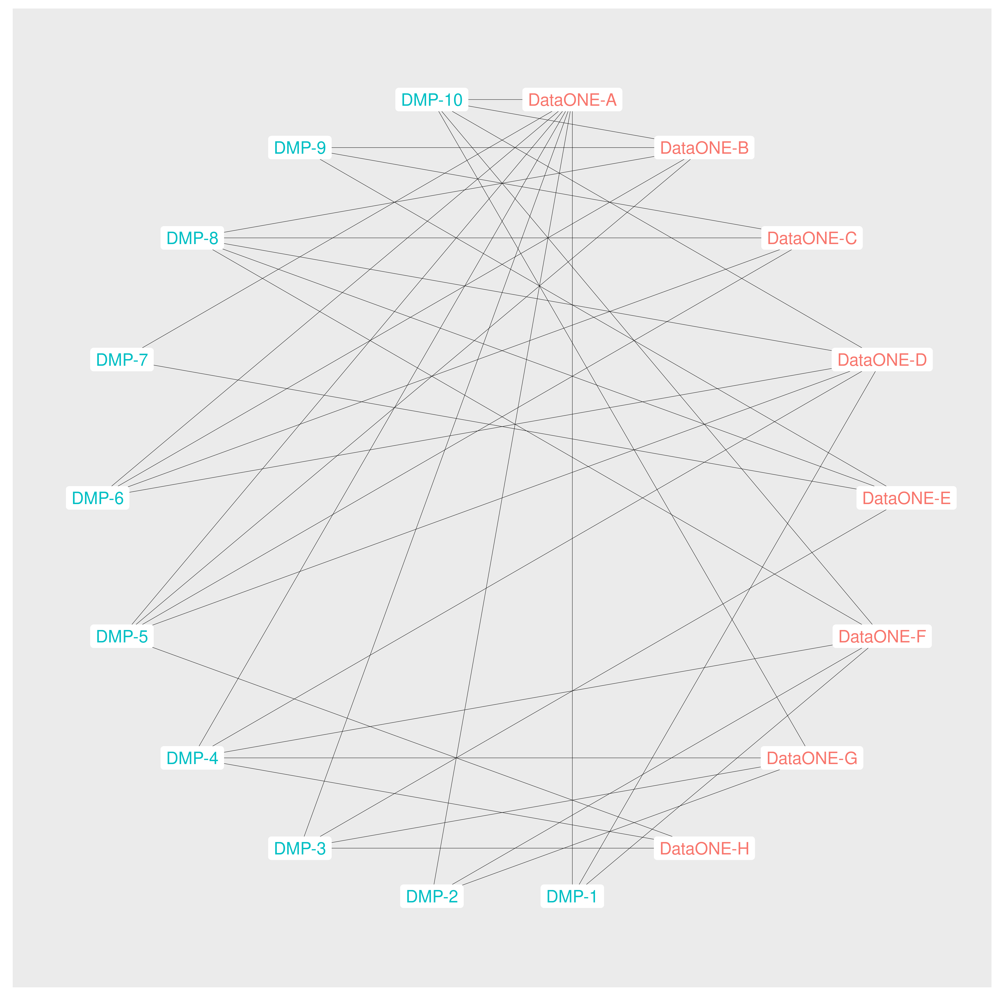
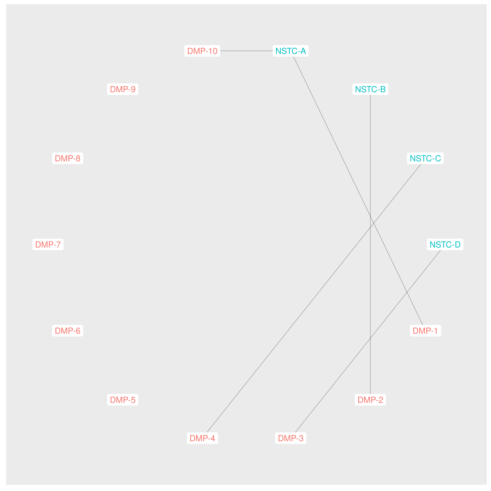
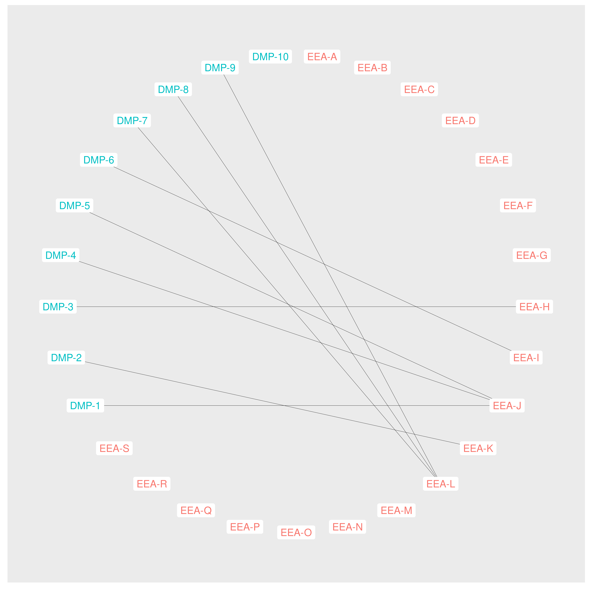
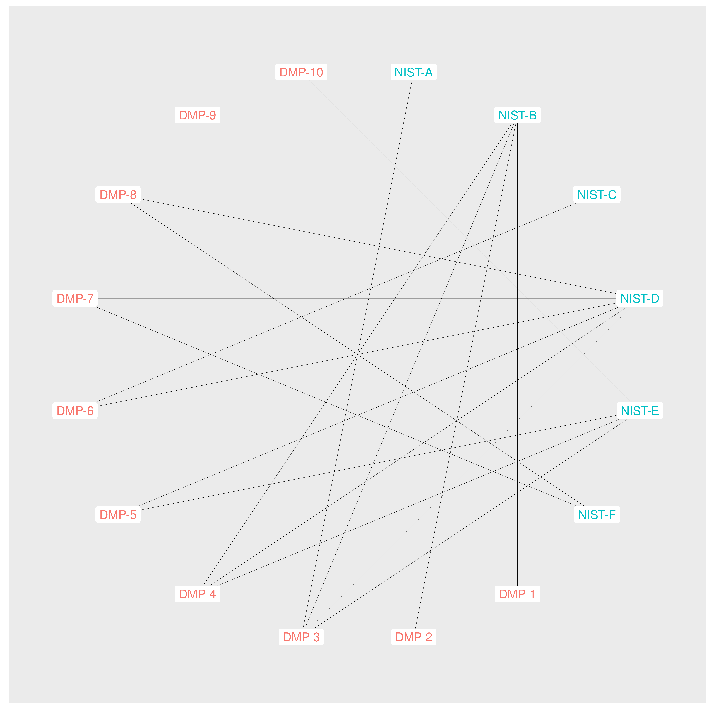
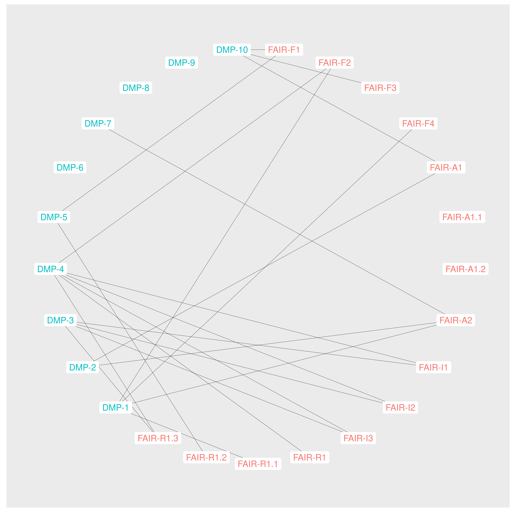
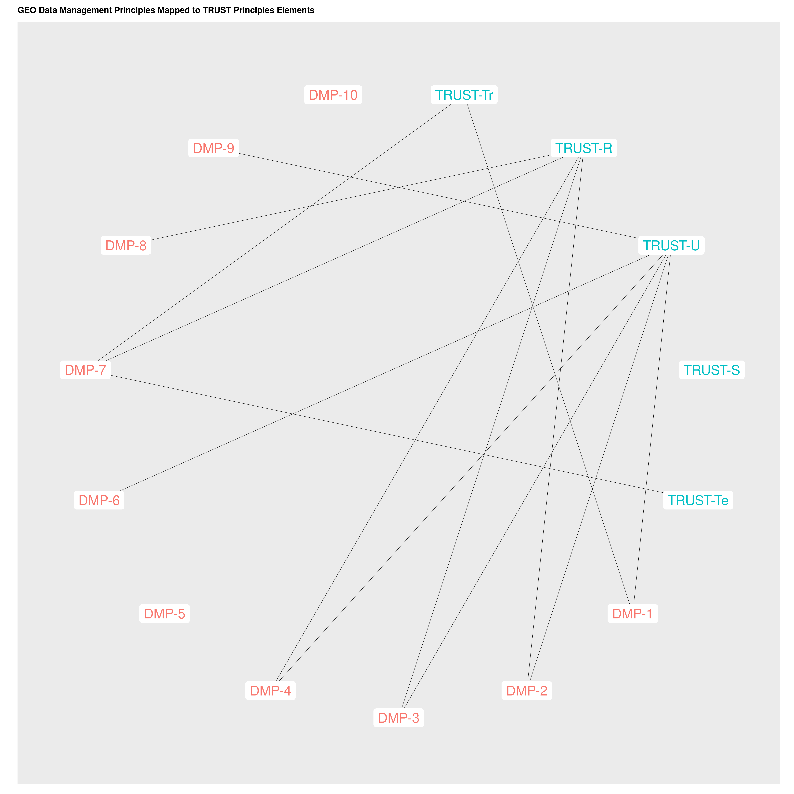

```{r, echo=FALSE, message=FALSE, warning=FALSE}
# load required libraries
library(googlesheets4)
library(googledrive)
library(tidyverse)
library(igraph)
library(ggraph)
library(knitr)
library(kableExtra)
library(flextable)

opts <- options(knitr.kable.NA = "")
```

| **GEO Working Group**: [Data Working Group (Data-WG)](https://www.earthobservations.org/data_wg.php)
| **Subgroup**: *Data Sharing and Data Management Principles* (Data-WG/DSDMP). In particular, the following subgroup members provided invaluable input into the development of the approach used in the development of this analysis: Bente Lija Bye, Eugenio Trumpy, Chris Jarvis, Jose Miguel Rubio Iglesias, Ethan McMahon, Robert R Downs, Chris Shubert, Sebastian Claus, Paula De Salvo


This document summmarizes the process and outputs of an analytic approach taken to increase the Data-WG and broader GEO community understanding of the relationship between the GEO [Data Sharing (pg 11)](https://www.earthobservations.org/documents/open_eo_data/GEO_Strategic_Plan_2016_2025_Implementing_GEOSS_Reference_Document.pdf) and [Data Management Principles (pg. 10)](https://www.earthobservations.org/documents/open_eo_data/GEO_Strategic_Plan_2016_2025_Implementing_GEOSS_Reference_Document.pdf) (referred to as *DSDMP* hereafter) and other data lifecycle models and reference principles (referred to as *reference frameworks* hereafter) that have been developed since the development of the GEO principles as part of the [2016-2025 GEO Strategic Plan](https://www.earthobservations.org/documents/open_eo_data/GEO_Strategic_Plan_2016_2025_Implementing_GEOSS.pdf). This document presents both a narrative description of the process followed in developing the initial connections between the DSDMP and reference frameworks, and summary visualizations of the preliminary data. 

The work presented herein was initiated in July 2021 within the Data-WG/DSDMP through a discussion within the subgroup to identify an initial set of reference frameworks to focus on in the identification of connections between the DSDMP and those reference frameworks. The identification of these connections was intended to serve three purposes:

* Identify gaps in the coverage by DSDMP concepts of elements of the reference frameworks
* Inform discussions for further development of the DSDMP with specific insights gained from the process of gap identification
* Enable enhanced communication of the DSDMP to audiences familiar with the reference frameworks through communication of the identified connections between the frameworks with which they are familiar and the DSDMP. 

Reference lifecycles and principles were included in the analysis to both address questions of how the DSDMP relate to the process steps emphasized in lifecycle models, and the more conceptual elements of the reference principles. Through addressing both reference lifecycles and principles we can gain a more holistic assessment of the current relationship between the DSDMP and the community's broader practice informed by values. The initial set of lifecycles and principles identified by the Data-WG/DSDMP included:

* [NOAA Environmental Data Management Framework](https://nosc.noaa.gov/EDMC/framework.php) (EDMF - not yet completed)
* [US National Science and Technology Council Common Framework for EO Data](https://usgeo.gov/uploads/common_framework_for_earth_observation_data.pdf) (NSTC - preliminary connections defined)
* [European Environment Agency Data/Information Management Framework](https://eni-seis.eionet.europa.eu/east/governance/project-documents/eea-data-information-management-framework)
 (EEA - preliminary connections defined)
 * [(US) National Institute for Standards and Technology Research Data Framework](https://www.nist.gov/system/files/documents/2021/01/29/RDaF%20Overvew%20Hanisch.pdf) (NIST - preliminary connections defined)
 * [DataONE Data Lifecycle](https://old.dataone.org/data-life-cycle) (DataONE - preliminary connections defined)
 * [FAIR Principles](https://www.nature.com/articles/sdata201618) (FAIR - preliminary connections defined)
 * [TRUST Principles](https://www.nature.com/articles/s41597-020-0486-7) (TRUST - preliminary connections defined)
 * CARE Principles (CARE - not yet completed)


## Data Collection

Following the identifcation of the reference frameworks to be used in the analysis a shared [Google spreadsheet](https://docs.google.com/spreadsheets/d/15Fmw0m2jx-wKNqyzB9AsRbDeokp9NowrZBd7XLHZTEc/edit#gid=1719949641) was developed in which the preliminary mappings between the DSDMP and each of the reference frameworks. The use of the spreadsheet allowed for rapid prototyping of the data model for capturing and organizing the developed mappings. The spreadsheet includes an `Instructions` worksheet that provides background information about the content and structure of the spreadsheet, a `Lifecycles` worksheet that provides reference information and labels for each of the selected reference frameworks, a `Crosswalk-DataSharingPrinciples` worksheet that provides reference information about the individual GEO data sharing principles and the mapping between those principles and the reference frameworks, and a `Crosswalk-DataManagementPrinciples` worksheet that provides reference information about the GEO data management principles and the mapping between those principles and the reference frameworks. 

The tabular structure within the prototype spreadsheet enables streamlined extraction of content of descriptive information about the individual DSDMT and reference frameworks and the identified connections between them. 

## Analysis

The extraction of data managed in the prototype spreadsheet is accomplished through R code (in the form of the R markdown document used to create this document and other analytic products) that:

* Reads the content of the individual data containing worksheets
  * `Lifecycles`
  * `Crosswalk-DataSharingPrinciples`
  * `Crosswalk-DataManagementPrinciples`
* Extracts and formats the data from each worksheet
* Presents the extracted connection information in tabular form
* Visualizes the connection information for graphic interpretation
* Presents the reference information about the DSDMP and reference frameworks


```{r, echo=FALSE, error=TRUE, warning=FALSE, message=FALSE, results="hide"}
# Crosswalk between GEO Data Management Principles and selected lifecycles and principles
gsheetURL <- "https://docs.google.com/spreadsheets/d/15Fmw0m2jx-wKNqyzB9AsRbDeokp9NowrZBd7XLHZTEc/edit#gid=1719949641"
gsheetSharingWorksheet <- "Crosswalk-DataSharingPrinciples"
gsheetManagementWorksheet <- "Crosswalk-DataManagementPrinciples"

gs4_deauth() # disable authentication requirements for this public sheet

# get the sheet ids from the google sheet url
ssid <- as_sheets_id(gsheetURL)
unclass(ssid)

# retrieve the base sheet content
lifecycles <- read_sheet(ssid, sheet = "Lifecycles", skip = 1, na = c("-", ""))
dmp_crosswalk <- read_sheet(ssid, sheet = "Crosswalk-DataManagementPrinciples")
dsp_crosswalk <- read_sheet(ssid, sheet = "Crosswalk-DataSharingPrinciples")

# extract nodes 
n_lifecycles <- lifecycles %>% 
  select(matches("-combo$")) %>% 
  gather() %>% 
  filter(!is.na(value)) %>% 
  distinct(value) %>% 
  mutate(label = str_split(value, "-", simplify = FALSE, n = 3)) %>% 
  select(label)

n_dmp <- dmp_crosswalk %>% 
  filter(!is.na(DataManagementPrinciple)) %>% 
  distinct(DataManagementPrinciple) %>% 
  mutate(label = DataManagementPrinciple) %>% 
  select(label)

n_all <- n_lifecycles %>% 
  rowwise() %>% 
  mutate(type = case_when(label[1] == "TRUST" ~ "principle",
                          label[1] == "FAIR" ~ "principle",
                          label[1] == "DataONE" ~ "lifecycle",
                          label[1] == "NIST" ~ "lifecycle",
                          label[1] == "EEA" ~ "lifecycle",
                          label[1] == "DataONE" ~ "lifecycle",
                          label[1] == "NSTC" ~ "lifecycle",
                          label[1] == "DataONE" ~ "lifecycle",
                          label[1] == "EDMF" ~ "lifecycle")) %>% 
  mutate(
    key = paste(label[1], label[2], sep = "-"), 
    source = label[1],
    short_label = key, 
    label = paste(paste(label[1], label[2], sep = "-"), label[3], sep = ": "),
    node_label = label) %>% 
  rbind(mutate(n_dmp,
               key = sapply(strsplit(label, ":"), "[[", 1),
               short_label = key, 
               node_label = label, 
               type = "GEO-Principle",
               source = "GEO")) %>% 
  select(key, short_label, node_label, source, type)
  

e_dmp_lifecycle <- tibble("from" = character(), "to" = character())
dmp_from <- dmp_crosswalk$DataManagementPrinciple
dmp_to <- dmp_crosswalk %>% select(-DataManagementPrinciple, -PrincipleDescription)

for (i in seq_along(dmp_to)) {
  out_to <- dmp_to[[i]]
  out_combined <- bind_cols(dmp_from, out_to)
  e_dmp_lifecycle <- rbind(e_dmp_lifecycle,out_combined)
}

e_dmp_lifecycle <- e_dmp_lifecycle %>% 
  rename(from = 1, to = 2) %>% 
  filter(!is.na(to)) %>% 
  mutate(lifecycle = str_split(to, "-", simplify = TRUE),
         from = sapply(strsplit(from, ":"), "[[", 1),)

n_dmp_lifecycle <- e_dmp_lifecycle %>% 
  select(from, to) %>% 
  gather() %>% 
  select(value) %>% 
  distinct(value)

```

### Developed Crosswalk Information

The following table summarizes the connections defined thus far between the GEO DSDMP and the reference frameworks. 

```{r, echo=FALSE, error=TRUE, warning=FALSE, message=FALSE}
dmp_crosswalk[c(1,4,5,6,7,8,9)] %>% 
  qflextable() %>% 
  set_header_labels(
    values = list(DataManagementPrinciple = "Data Management Principle",
                  "Lifecycle-EDMF" = "EDMF",
                  "Lifecycle-NSTC" = "NSTC",
                  "Lifecycle-EEA" = "EEA",
                  "Lifecycle-NIST" = "NIST",
                  "Lifecycle-DataONE" = "DataONE",
                  "Principle-FAIR" = "FAIR",
                  "Principle-TRUST" = "TRUST")) %>% 
  fontsize(size = 7, part = "body") %>% 
  fit_to_width(max_width = 6.5, unit = "in")
```
\newpage
## Visualization of DSDMP Relationships with Reference Lifecycles and Principles

```{r, echo=FALSE, error=TRUE, warning=FALSE, message=FALSE}
# circular plot 1x1 funciton
geo_x_single <- function(title, to_nodes, output_file) {
  edges <- filter(e_dmp_lifecycle, lifecycle[,1] == to_nodes)
  #print(edges)
  vertices <- filter(n_all, (source == to_nodes | source == "GEO"))
  #print(vertices)
  graph <- graph_from_data_frame(
    d = edges,
    vertices = vertices,
    directed = TRUE)
  xy <- layout_(graph,in_circle())
  circular_plot <- ggraph(graph, layout = "linear", circular = TRUE) +
    coord_fixed() +
    geom_edge_link0(width = .1) +
    geom_node_point(aes(color = as.factor(source)), size = 1, show.legend = FALSE) +
    geom_node_label(aes(label = short_label, 
                        color = as.factor(source)), 
                    label.size = 0,
                    show.legend = FALSE) +
    xlim(-1.1, 1.1) +
    ylim(-1.1, 1.1) +
    #ggtitle(title) +
    theme(plot.title = element_text(size = 7, face = "bold"))
  ggsave(paste("images/circular_", output_file, sep = ""), plot = circular_plot, width = 9, height = 9, dpi = 600)
  
   default_plot <- ggraph(graph) +
    geom_edge_link0(width = .1) +
    geom_node_point(aes(color = as.factor(source)), size = 1, show.legend = FALSE) +
    geom_node_label(aes(label = short_label, 
                        color = as.factor(source)), 
                    label.size = 0,
                    show.legend = FALSE) +
    #ggtitle(title) +
    theme(plot.title = element_text(size = 7, face = "bold"))
  ggsave(paste("images/auto_", output_file, sep = ""), plot = default_plot, width =12, height =12, dpi = 600)
  
  #figures <- c(paste("./images/circular_", output_file, sep = ""), paste("./images/auto_", output_file, sep = ""))
  #return(figures)
}
```

GEO Data Management Principles Mapped to DataONE Lifecycle Elements

```{r, echo=FALSE, error=TRUE, warning=FALSE, message=FALSE}
geo_x_single(
  "GEO Data Management Principles Mapped to DataONE Lifecycle Elements",
  "DataONE", 
  "dataone.png")
```

{width=6in}
<!--  -->
\newpage
GEO Data Management Principles Mapped to NSTC Lifecycle Elements

```{r, echo=FALSE, error=TRUE, warning=FALSE, message=FALSE}
geo_x_single(
  "GEO Data Management Principles Mapped to NSTC Lifecycle Elements",
  "NSTC", 
  "nstc.png")
```

{width=6in}
\newpage
GEO Data Management Principles Mapped to EEA Lifecycle Elements

```{r, echo=FALSE, error=TRUE, warning=FALSE, message=FALSE}
geo_x_single(
  "GEO Data Management Principles Mapped to EEA Lifecycle Elements",
  "EEA", 
  "eea.png")
```

{width=6in}
\newpage
GEO Data Management Principles Mapped to NIST Lifecycle Elements

```{r, echo=FALSE, error=TRUE, warning=FALSE, message=FALSE}
geo_x_single(
  "GEO Data Management Principles Mapped to NIST Lifecycle Elements",
  "NIST", 
  "nist.png")
```

{width=6in}
\newpage
GEO Data Management Principles Mapped to FAIR Principles Elements

```{r, echo=FALSE, error=TRUE, warning=FALSE, message=FALSE}
geo_x_single(
  "GEO Data Management Principles Mapped to FAIR Principles Elements",
  "FAIR", 
  "fair.png")
```

{width=6in}
\newpage
GEO Data Management Principles Mapped to TRUST Principles Elements

```{r, echo=FALSE, error=TRUE, warning=FALSE, message=FALSE}
geo_x_single(
  "GEO Data Management Principles Mapped to TRUST Principles Elements",
  "TRUST", 
  "trust.png")
```

{width=6in}
\newpage
Crosswalk of GEO, FAIR, and TRUST principles

```{r, echo=FALSE, error=TRUE, warning=FALSE, message=FALSE}
# combined graph for all principles
graph <- graph_from_data_frame(
    d = filter(e_dmp_lifecycle, (lifecycle == "FAIR" | lifecycle == "TRUST") ),
    vertices = filter(n_all, (source == "FAIR" | source == "TRUST" | source == "GEO") ),
    directed = FALSE)
xy <- layout_(graph,in_circle())
mygraph <- ggraph(graph, layout = "linear", circular = TRUE) +
    coord_fixed() +
    geom_edge_link0(aes(color = lifecycle), width = .5) +
    geom_node_point(aes(color = as.factor(source)), size = 1, show.legend = FALSE) +
    geom_node_label(aes(label = short_label, 
                        color = as.factor(source)), 
                    label.size = 0,
                    show.legend = FALSE) +
    xlim(-1.1, 1.1) +
    ylim(-1.1, 1.1) +
    #ggtitle("Crosswalk of GEO, FAIR, and TRUST principles") +
    theme(plot.title = element_text(size = 7, face = "bold"))
ggsave(paste("images/circular_","principles.png", sep = ""), width = 12, height = 12, dpi = 600)

```


```{r, echo=FALSE, error=TRUE, warning=FALSE, message=FALSE}
#
```

{width=6in}

```{r, echo=FALSE, error=TRUE, warning=FALSE, message=FALSE}
mygraph <- ggraph(graph) +
  coord_fixed() +
  geom_edge_link0(aes(color = lifecycle), width = .5) +
  geom_node_point(aes(color = as.factor(source)), size = 1, show.legend = FALSE) +
  geom_node_label(aes(label = short_label, 
                      color = as.factor(source)), 
                  label.size = 0,
                  show.legend = FALSE) +
  #ggtitle("Crosswalk of GEO, FAIR, and TRUST principles") +
  theme(plot.title = element_text(size = 7, face = "bold"))
ggsave(paste("images/auto_","principles.png", sep = ""), width = 18, height = 18, dpi = 600)
```

{width=6in}


\newpage
## Next Steps

While the current spreadsheet provides a useful initial platform for capturing and sharing the initial mappings, it does not provide a scalable data structure that will enable streamlined collection of data from multiple contributors, allowing for cross-validation of identified connections. Next steps for work on this project include the following:

* Transitioning to a data model that will enable capture and management of connection information from multiple contributors - enabling cross validation of identified connections.
* Expansion of the data model to capture information about the nature of the connections
* Develop an online dashboard that provides current connection information based upon community contributed data
* Publish the results of the analysis in one or more Earth Science data publication venues


## Appendix A - Reference Information for the Data Sharing and Data Management Principles

```{r, echo=FALSE, error=TRUE, warning=FALSE, message=FALSE}
n_all[c(3)] %>% 
  qflextable() %>% 
  set_header_labels(
    values = list(node_label = "Lifecycle/Principle label and Description")) %>% 
  fontsize(size = 7, part = "body") %>% 
  fit_to_width(max_width = 6.5, unit = "in")
```
